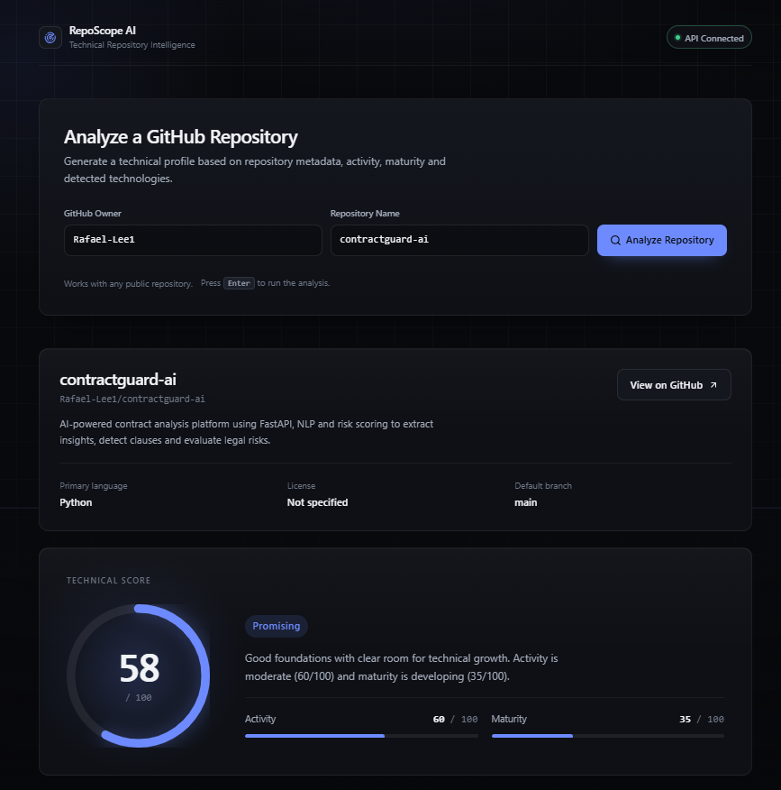

# RepoScope AI

Aplicação web para análise técnica de repositórios públicos do GitHub. Informe
um `owner` e um `repository` e receba um perfil técnico com pontuação,
atividade, maturidade, tecnologias detectadas e insights gerados a partir dos
metadados públicos do repositório.

---

## Preview

<<<<<<< HEAD



=======

>>>>>>> 18af840 (docs: fix application preview)

---

## Sobre o projeto

Avaliar a qualidade de um repositório no GitHub normalmente exige abrir várias
abas e interpretar manualmente um conjunto disperso de métricas: data do último
commit, estrelas, forks, existência de licença, tamanho do projeto e
tecnologias utilizadas.

O RepoScope AI centraliza essas informações em uma única consulta e as
transforma em indicadores objetivos. A partir dos metadados públicos do
repositório, o backend calcula três pontuações independentes — atividade,
maturidade e pontuação técnica — além de detectar tecnologias e produzir uma
lista de pontos positivos e de atenção.

O objetivo é oferecer uma leitura rápida e justificável de um repositório, útil
tanto para quem avalia um projeto quanto para quem quer identificar o que
melhorar no próprio repositório.

---

## Funcionalidades

- Consulta de repositórios públicos do GitHub por `owner` e `repository`.
- Busca de metadados públicos via GitHub REST API.
- Exibição de informações do repositório: descrição, linguagem principal,
  licença, branch padrão, tópicos e link.
- Exibição de métricas: estrelas, forks, issues abertas, watchers e tamanho.
- Exibição de datas: criação, última atualização, último push e dias desde o
  último push.
- Cálculo de pontuação de atividade.
- Cálculo de pontuação de maturidade.
- Cálculo de pontuação técnica consolidada, com classificação.
- Detecção de tecnologias/stack.
- Geração de insights: pontos positivos e pontos de atenção.
- Interface web para visualização da análise, com estados de carregamento,
  erro e vazio.
- Indicador de status da API no cabeçalho.
- Validação de entrada no backend, com resposta HTTP 400 para `owner` ou
  `repository` inválidos.

---

## Tecnologias

### Frontend

- React 19
- TypeScript
- Vite
- lucide-react (única dependência de interface)
- ESLint

### Backend

- Python
- FastAPI
- Uvicorn
- HTTPX (cliente HTTP assíncrono)

### Integração

- GitHub REST API pública

---

## Arquitetura

O frontend não acessa o GitHub diretamente. Toda a coleta e o processamento
acontecem no backend.

```
React + TypeScript (Vite)
        |
        |  HTTP / JSON
        v
FastAPI
        |
        |  HTTPS
        v
GitHub REST API
```

O backend expõe três endpoints:

| Método | Endpoint | Descrição |
| --- | --- | --- |
| GET | `/` | Identificação da API (nome, status e versão). |
| GET | `/health` | Verificação de disponibilidade, consumida pelo frontend. |
| GET | `/api/repositories/{owner}/{repo}` | Executa a análise e retorna o resultado completo. |

---

## Como funciona a análise

1. O usuário informa o `owner` e o `repository` na interface.
2. O backend valida as duas entradas antes de qualquer requisição.
3. O backend consulta `https://api.github.com/repos/{owner}/{repo}`.
4. Os metadados retornados são processados e normalizados.
5. Os indicadores são calculados: atividade, maturidade, pontuação técnica,
   tecnologias detectadas e insights.
6. O resultado é retornado em JSON e apresentado na interface.

---

## Indicadores analisados

Todos os indicadores são calculados de forma determinística no backend, a
partir dos metadados públicos do repositório.

| Indicador | Escala | Descrição |
| --- | --- | --- |
| **Atividade** | 0–100 + status | Baseada nos dias desde o último push. Status: `very_active`, `active`, `moderate`, `low`, `inactive` ou `unknown`. |
| **Maturidade** | 0–100 + nível | Baseada em descrição, licença, tamanho do repositório, estrelas, forks e issues abertas. Níveis: `early_stage`, `developing` ou `mature`. |
| **Pontuação técnica** | 0–100 | Combina atividade e maturidade com sinais objetivos (descrição, licença, linguagem principal e tamanho). Classificação: `excellent`, `strong`, `promising`, `developing` ou `early_stage`. |
| **Tecnologias detectadas** | lista | Detecção por palavras-chave sobre a linguagem principal, a descrição e os tópicos do repositório. |
| **Insights** | duas listas | Pontos positivos e pontos de atenção derivados de regras objetivas sobre os indicadores. |

---

## Estrutura do projeto

```
reposcope-ai/
├── backend/
│   ├── app/
│   │   ├── __init__.py
│   │   └── main.py            # API FastAPI, regras de análise e integração com o GitHub
│   ├── .env.example           # Referência das variáveis de ambiente
│   └── requirements.txt       # Dependências com versões fixadas
├── frontend/
│   ├── public/
│   ├── src/
│   │   ├── components/        # Componentes de interface
│   │   ├── constants/         # Metadados de status e classificação
│   │   ├── hooks/             # Hooks reutilizáveis
│   │   ├── services/          # Cliente da API e validação da resposta
│   │   ├── types/             # Tipos que espelham o contrato da API
│   │   ├── utils/             # Formatação, erros e interpretação
│   │   ├── App.tsx
│   │   └── main.tsx
│   ├── index.html
│   └── package.json
├── docs/
│   ├── ARCHITECTURE.md
│   └── images/                # Capturas de tela (ver seção Preview)
├── infra/
│   └── terraform/             # Reservado; não provisiona recursos no estado atual
├── DESIGN.md                  # Direção visual e de interação do frontend
└── README.md
```

---

## Como executar localmente

### Pré-requisitos

- Python 3.10 ou superior
- Node.js 18 ou superior

### Backend

```bash
cd backend
python -m venv .venv
source .venv/bin/activate
pip install -r requirements.txt
uvicorn app.main:app --reload
```

A API fica disponível em `http://localhost:8000`. A documentação interativa
gerada pelo FastAPI pode ser acessada em `http://localhost:8000/docs`.

Opcionalmente, copie `backend/.env.example` para `backend/.env` para configurar
as origens permitidas pelo CORS:

```bash
cp backend/.env.example backend/.env
```

### Frontend

```bash
cd frontend
npm install
npm run dev
```

A interface fica disponível em `http://localhost:5173`.

O endereço do backend é lido da variável `VITE_API_BASE_URL` e, quando não
definida, assume `http://localhost:8000`.

---

## Qualidade e validação

Comandos utilizados para validar o projeto.

**Backend**

```bash
cd backend
python -m py_compile app/main.py
```

**Frontend**

```bash
cd frontend
npm run build
npm run lint
npm run typecheck
```

- `npm run build` executa a checagem de tipos e o build de produção.
- `npm run lint` executa o ESLint configurado no projeto.
- `npm run typecheck` executa a checagem de tipos sem gerar arquivos de saída.

---

## Segurança

- Nenhum token, chave ou credencial está versionado no repositório.
- O arquivo `.env` não é rastreado pelo Git. O `.env.example` é a referência
  pública das variáveis utilizadas.
- As dependências do backend possuem versões fixadas em `requirements.txt`.
- O backend valida `owner` e `repository` antes de montar a requisição,
  retornando HTTP 400 para entradas inválidas.
- O host consultado é fixo (`api.github.com`), portanto o usuário não controla
  a URL de destino da requisição.
- As mensagens de erro devolvidas ao cliente são genéricas. Os detalhes
  técnicos ficam restritos ao log do servidor.
- O CORS é configurado por lista explícita de origens permitidas, sem uso de
  curinga.

O projeto adota práticas básicas de segurança adequadas ao seu escopo. Não há
autenticação de usuários, banco de dados ou tratamento de dados sensíveis.

---

## Limitações atuais

- A análise é baseada exclusivamente em metadados públicos do GitHub. O
  conteúdo do código-fonte não é lido nem interpretado.
- O foco atual são repositórios públicos. Repositórios privados não são
  suportados.
- A detecção de tecnologias é heurística, baseada em palavras-chave presentes
  na linguagem, na descrição e nos tópicos. Pode haver falsos positivos.
- As pontuações seguem regras fixas e servem como indicadores de leitura
  rápida, não como avaliação definitiva de qualidade.
- O projeto não substitui ferramentas profissionais de análise de qualidade de
  código, cobertura de testes ou segurança.
- Sem autenticação, a API do GitHub aplica o limite de requisições anônimo (60
  requisições por hora por IP), o que pode interromper análises em uso intenso.

---

## Roadmap futuro

Os itens abaixo **não estão implementados**. São melhorias consideradas para
versões futuras.

- [ ] Análise mais profunda de arquivos e estrutura do repositório.
- [ ] Integração autenticada com o GitHub.
- [ ] Suporte a repositórios privados mediante autorização do usuário.
- [ ] Indicadores adicionais.

---

## Autor

**Rafael Santos**
Full Stack Developer

- GitHub: [Rafael-Lee1](https://github.com/Rafael-Lee1)
- Repositório: [Rafael-Lee1/reposcope-ai](https://github.com/Rafael-Lee1/reposcope-ai)
